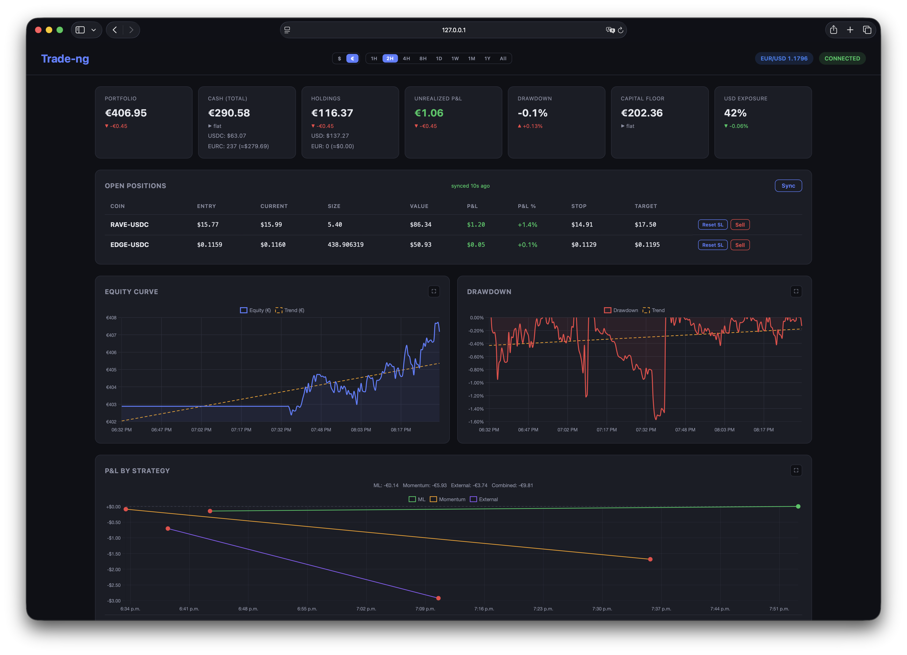
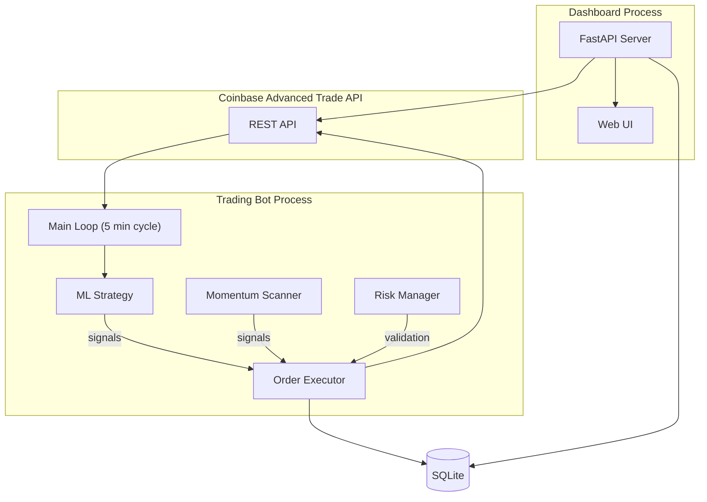
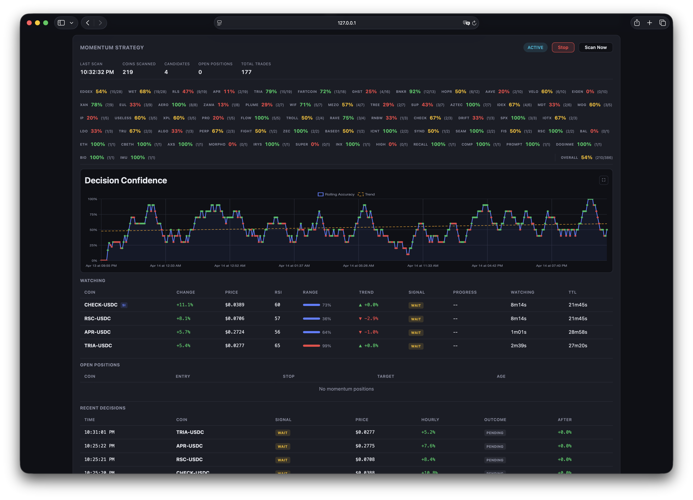
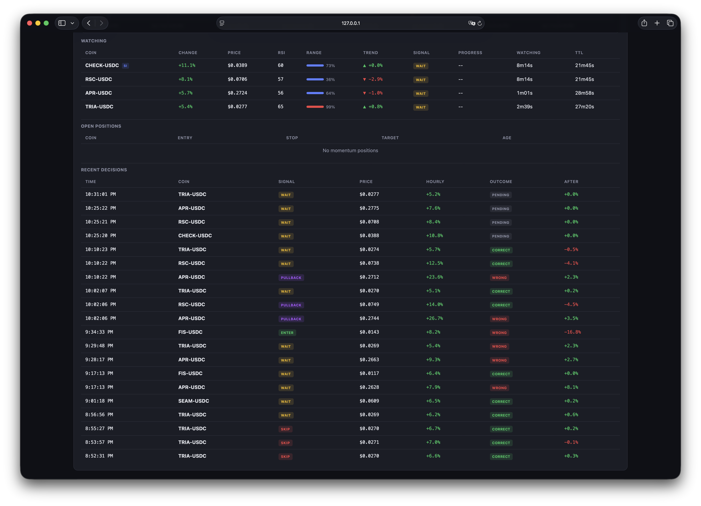
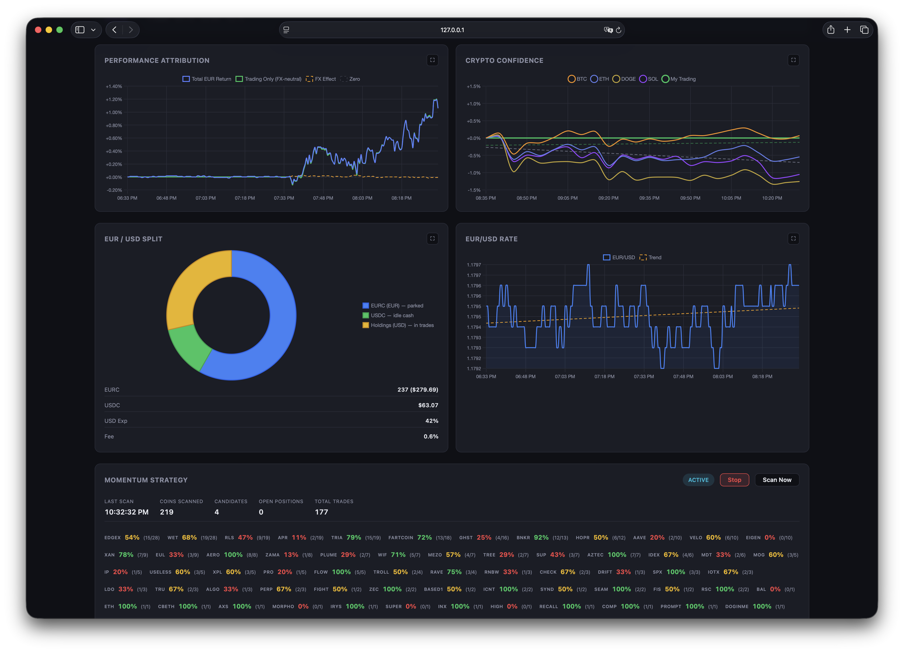
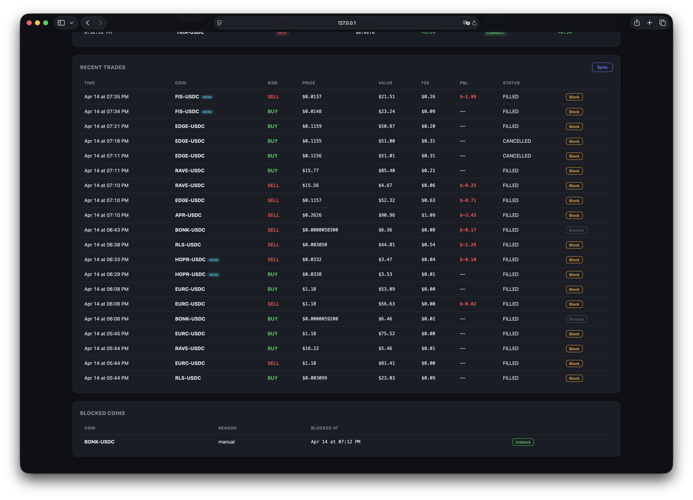

# Trade-ng

An automated cryptocurrency trading agent for Coinbase Advanced Trade. Combines an ML ensemble (XGBoost + LSTM) with a real-time momentum scanner, wrapped in multi-layered risk management and a live web dashboard.



## Features

- **Dual Strategy**: ML ensemble for swing signals + momentum scanner for short-term breakouts
- **200+ Coins**: Auto-discovers all Coinbase USDC pairs above a configurable volume threshold
- **6-Layer Capital Protection**: Spot-only, hard capital floor, progressive drawdown throttling, per-trade limits, pre-trade validation, independent watchdog
- **Live Dashboard**: Real-time portfolio tracking, equity curves, P&L attribution, EUR/USD management
- **FX Management**: Automatic EUR/USDC rebalancing with configurable exposure limits
- **Backtesting**: Walk-forward cross-validation with event-driven engine

## Architecture



The trading bot and dashboard run as separate processes. The bot executes the main trading loop and the momentum scanner in background threads. The dashboard reads shared state from the SQLite database and persisted JSON files, and can trigger actions (manual sells, sync, momentum scan) via file-based signaling.

## ML Strategy

The ML strategy runs on a 5-minute loop, evaluating every coin in the universe against an ensemble of two models.

### Feature Engineering

Each coin's OHLCV candle history is enriched with ~30 technical and market features:

- **Technical**: RSI, MACD, ADX, CCI, Ichimoku, EMA spread, Bollinger Bands, ATR, Stochastic, Williams %R, ROC, OBV, VWAP, MFI
- **Market**: Multi-horizon log returns, realized volatility (multiple windows), volume z-score, high-low range, price vs. moving averages
- **Cross-asset**: Correlation and beta relative to BTC

### Signal Generation

1. **XGBoost** (classifier): outputs probability that future return exceeds a configurable threshold
2. **LSTM** (regressor): predicts next-candle log return, mapped to [0, 1] via sigmoid
3. **Ensemble**: weighted combination (default 60/40 XGBoost/LSTM). Score above `buy_threshold` triggers BUY; below `sell_threshold` triggers SELL

### Execution

- Buys are placed as **limit orders** at the current price
- Position size is determined by a half-Kelly formula scaled by signal strength, capped by ATR-based risk and portfolio concentration limits
- After fill, **stop-loss** and **take-profit** are set using ATR multipliers
- **Progressive trailing stop**: as unrealized gain increases through 1% / 2% / 3% tiers, the trailing distance tightens from 100% to 35% of the initial ATR-based stop distance

### Safeguards

- **Cooldown**: after a stop-loss, the coin is blocked from re-entry for a configurable period (shared across strategies)
- **Repeated loss detection**: if a coin triggers 2+ stop-losses within 4 hours, further ML buys are blocked
- **Blocklist**: coins can be manually blocked from the dashboard

## Momentum Strategy

The momentum scanner runs continuously in a background thread, detecting and trading short-term price breakouts.



### Candidate Detection

Every 30 seconds, the scanner compares current prices against a rolling 1-hour lookback. Coins with hourly change above `min_hourly_change_pct` (default 5%) and below 50% (spike filter) become candidates.

### Entry Analysis

Candidates enter a watchlist (TTL 30 min) and are evaluated using 5-minute candle data:

| Indicator | Role |
|-----------|------|
| RSI | Overbought filter (skip above 75) |
| Range position | Where price sits in its recent high-low range |
| Short trend | Slope of recent prices |
| Pullback % | Drop from local peak |
| Volume ratio | Current vs. average volume |

Based on these indicators, the scanner makes one of four decisions:

- **Enter**: conditions align (e.g., pullback with low range position, or early-move with positive trend)
- **Pullback watch**: strong mover monitored through a drop/bounce state machine before entry
- **Wait**: promising but not ready (e.g., negative trend, low volume)
- **Skip**: overbought or unsuitable

### Decision Confidence

Every decision is recorded and evaluated against the actual price movement 15 minutes, 1 hour, and 2 hours later. A rolling accuracy chart tracks whether the scanner's calls were correct.



### Exit Management

- **Dynamic stop-loss and take-profit**: computed from recent volatility and range position, with configurable floors and caps
- **Trailing stop**: ratchets up as price makes new highs
- **Time cap**: positions are closed after `max_hold_minutes` (default 120 min)
- **Minimum hold**: exits are suppressed for `min_hold_seconds` after entry to avoid whipsaws
- **Scale-in**: additional tranches can be added on schedule if the position is profitable and trend is positive

## Risk Management

Six independent safety layers protect capital:

1. **Spot-only**: no margin, leverage, or shorting — structurally impossible to lose more than deposited
2. **Capital floor**: if portfolio value drops below 50% of initial capital, all positions are liquidated and trading halts permanently
3. **Progressive throttling**: position sizes are automatically reduced as drawdown increases through 10% / 20% / 30% / 40% tiers, eventually entering sell-only mode
4. **Per-trade limits**: mandatory stop-losses, max 5% of portfolio per position, max 20% concentration in any single coin
5. **Pre-trade validation**: every order is checked against all limits before submission (state, position count, size, concentration, available cash)
6. **Watchdog**: independent thread checks actual Coinbase balances every 30 seconds and triggers emergency liquidation if the capital floor is breached

Additional protections:
- **Cross-strategy cooldown**: shared cooldown tracker prevents re-entry after stop-losses, persisted across restarts
- **Daily and hourly loss limits**: trading is automatically halted if rolling losses exceed configurable thresholds
- **Coin blocklist**: manual or automatic blocking of problematic coins

## Dashboard

The web dashboard provides real-time monitoring of all trading activity.


The top section shows portfolio value (in EUR or USD), cash breakdown, holdings, unrealized P&L, drawdown, capital floor, and USD exposure. A global time selector controls all charts (1h to all-time), and a currency toggle switches between EUR and USD display.



The middle section includes performance attribution (separating trading returns from FX effects), crypto confidence benchmarks (BTC, ETH, DOGE, SOL vs. portfolio), EUR/USD split with EURC parking, and the EUR/USD exchange rate.



The trade log shows all recent trades with side, price, value, fees, P&L, and strategy tags (ML or MOM). Each trade has a Block button to add the coin to the blocklist. Open positions have Reset SL and Sell buttons for manual intervention. Position sync reconciles the local database with Coinbase.

## Quick Start

```bash
# Install dependencies
pip install -r requirements.txt

# Configure API keys
cp .env.example .env
# Edit .env with your Coinbase CDP key file path

# Train models on historical data
python -m src.main train

# Start live trading
python -m src.main run

# Launch web dashboard (separate terminal)
python -m src.main dashboard
```

## CLI Commands

| Command | Description |
|---------|-------------|
| `python -m src.main run` | Start live trading bot |
| `python -m src.main train` | Train/retrain ML models |
| `python -m src.main backtest` | Run backtesting simulation |
| `python -m src.main status` | Show portfolio and open positions |
| `python -m src.main dashboard` | Launch web monitoring dashboard |

## Configuration

Edit `config/settings.yaml` to adjust:
- Trading parameters (interval, fees, order timeout)
- Risk limits (max loss, position sizes, drawdown tiers)
- ML model hyperparameters (thresholds, horizons)
- Momentum scanner settings (scan interval, entry/exit criteria, scale-in)
- FX management (home currency, exposure limits, rebalance thresholds)

Edit `config/coins.yaml` to control the trading universe.

## License

This project is licensed under the BSD 2-Clause License. See [LICENSE](LICENSE) for details.

## Disclaimer

**Algorithmic trading carries significant financial risk.** Past performance does not guarantee future results. This software is provided "as is", without warranty of any kind. You are solely responsible for any financial losses incurred. Never trade with money you cannot afford to lose.
